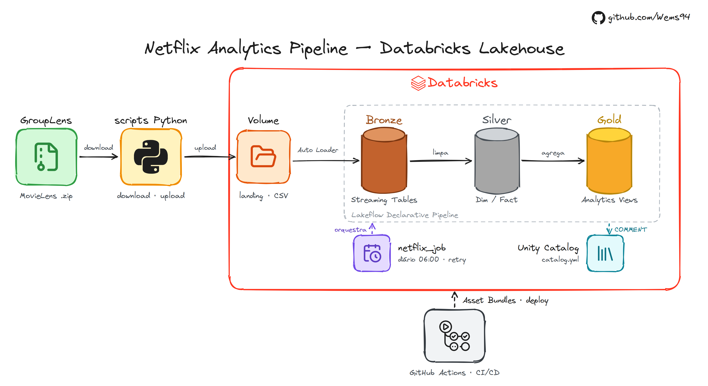

---

# Pipeline de Dados no Databricks — Arquitetura Medallion (Bronze, Silver e Gold)

Pipeline de dados ponta a ponta com o dataset **MovieLens Beliefs 2024**, construído no **Databricks** com **Lakeflow Declarative Pipelines**, **Unity Catalog** e **Databricks Asset Bundles**, todo desenvolvido e publicado a partir do VS Code.

> Este projeto é a migração do [netflix-pipeline-gcp](https://github.com/Wems94/netflix-pipeline-gcp) (BigQuery + GCS) para o Databricks, mantendo a mesma lógica de negócio.

---

## 🏗️ Arquitetura



Um **job** orquestra o fluxo diário: roda o pipeline e, em seguida, aplica as descrições do `catalog/catalog.yml` em todas as tabelas e colunas.

---

## 🗂️ Estrutura do Repositório

```
netflix-pipeline-databricks/
├── .github/workflows/ci.yml     # CI: lint (ruff + sqlfluff) e validação do bundle
├── catalog/catalog.yml          # Catálogo de dados (descrição de tabelas e colunas)
├── resources/
│   ├── netflix_pipeline.yml     # Lakeflow Declarative Pipeline (Bronze → Silver → Gold)
│   └── netflix_job.yml          # Job: pipeline + aplicação do catálogo, agendado e com alerta
├── scripts/
│   ├── setup_catalog.py         # Cria schemas e volume no Unity Catalog
│   ├── download_dataset.py      # Baixa e extrai o dataset do GroupLens
│   ├── upload_raw.py            # Envia os CSVs para o volume
│   └── apply_catalog.py         # Aplica o catalog.yml como COMMENTs no Unity Catalog
├── src/
│   ├── bronze/                  # 6 streaming tables (CSV bruto via Auto Loader)
│   ├── silver/                  # 5 materialized views (limpas, tipadas, deduplicadas)
│   └── gold/                    # 9 materialized views analíticas
├── docs/architecture.png        # Diagrama da arquitetura
├── databricks.yml               # Configuração do bundle (targets dev/prod)
├── Makefile                     # Atalhos para os comandos do projeto
├── pyproject.toml               # Dependências (gerenciadas com uv)
└── .sqlfluff                    # Regras de lint SQL (dialeto Databricks)
```

---

## 🛠️ Tecnologias

| Tecnologia                                      | Finalidade                                             |
| ----------------------------------------------- | ------------------------------------------------------ |
| **Databricks (Free Edition, serverless)** | Plataforma de processamento                            |
| **Unity Catalog**                         | Governança: catálogo, schemas, volume e descrições |
| **Lakeflow Declarative Pipelines**        | Orquestração declarativa das camadas Medallion       |
| **Auto Loader (`read_files`)**          | Ingestão incremental dos CSVs na Bronze               |
| **Delta Lake**                            | Formato de armazenamento das tabelas                   |
| **Databricks Asset Bundles**              | Infraestrutura como código (pipeline e job)           |
| **Databricks CLI + SDK Python**           | Deploy e automação a partir do VS Code               |
| **uv**                                    | Gerenciamento de ambiente e dependências Python       |
| **ruff / sqlfluff**                       | Lint de Python e SQL                                   |
| **GitHub Actions**                        | CI: lint e validação do bundle a cada push           |

---

## 🥉🥈🥇 Camadas

### Bronze — Streaming tables

Os CSVs são lidos do volume `netflix.bronze.landing` com **Auto Loader**, e todas as colunas ficam como `STRING`, sem transformação. Cada linha recebe as colunas de auditoria `_source_file` e `_ingested_at`. Por ser incremental, cada execução processa **apenas arquivos novos**.

### Silver — Materialized views

- Tipagem com `try_cast` e `try_to_timestamp`
- Deduplicação com `QUALIFY row_number()`
- Surrogate key determinística (MD5) em `fact_ratings`
- União das duas fontes de ratings
- **Liquid clustering** (`CLUSTER BY`) no lugar de partição manual

| Tabela                          | Descrição                                            |
| ------------------------------- | ------------------------------------------------------ |
| `dim_movies`                  | Filmes com ano de lançamento extraído do título     |
| `dim_movie_elicitation`       | Filmes da elicitação com critério decodificado      |
| `fact_ratings`                | Avaliações unificadas e deduplicadas (6,1 mi linhas) |
| `fact_belief_data`            | Ratings esperados antes de assistir                    |
| `fact_recommendation_history` | Recomendações do sistema com rating previsto         |

### Gold — Materialized views analíticas

| Tabela                               | Descrição                                          |
| ------------------------------------ | ---------------------------------------------------- |
| `vw_movies_kpis`                   | Média, total, desvio padrão e timestamps por filme |
| `vw_genre_performance`             | Performance por gênero                              |
| `vw_ratings_heatmap`               | Volume de ratings por mês e ano                     |
| `vw_top_movies`                    | Ranking dos filmes mais avaliados                    |
| `vw_user_activity`                 | Atividade e engajamento por usuário                 |
| `vw_scatter_popularity_vs_quality` | Filmes com 50+ avaliações                          |
| `vw_recommendation_accuracy`       | MAE e RMSE do sistema de recomendação              |
| `vw_user_cohort_analysis`          | Retenção por coorte de entrada                     |
| `vw_belief_vs_reality`             | Gap entre expectativa e rating real                  |

---

## 🐛 Correções em relação à versão GCP

A migração expôs quatro problemas silenciosos da versão original. Todos foram corrigidos e validados contra os CSVs de origem:

| Problema                                                                                    | Impacto no BigQuery                    | Correção                             |
| ------------------------------------------------------------------------------------------- | -------------------------------------- | -------------------------------------- |
| `watchDate` vem como `yyyy-MM-dd HH:mm:ss`, mas era lido com `PARSE_DATE('%Y-%m-%d')` | `watch_date` 100% nulo               | Conversão dos 10 primeiros caracteres |
| `tstamp` das recomendações está em Unix epoch, mas era lido como texto de data         | `recommendation_ts` 100% nulo        | `timestamp_seconds()`                |
| Coluna`movie_idx` do `belief_data` declarada como `month_idx`                         | Nome e descrição incorretos          | Nome real da coluna                    |
| Títulos com aspas escapadas (`""`) seguidas de vírgula                                  | 1 filme com gênero corrompido         | `escape => '"'` na leitura do CSV    |
| `COUNT(*)` com `LEFT JOIN` em `vw_top_movies`                                         | Filmes sem avaliação contados como 1 | `COUNT(fr.movie_id)`                 |

---

## ✅ Pré-requisitos

- [VS Code](https://code.visualstudio.com/) com a extensão **Databricks**
- [Databricks CLI](https://docs.databricks.com/dev-tools/cli/install.html)
- [uv](https://docs.astral.sh/uv/)
- Conta na [Databricks Free Edition](https://www.databricks.com/learn/free-edition)

---

## 🚀 Como Executar

### 1. Clonar e instalar dependências

```bash
git clone https://github.com/Wems94/netflix-pipeline-databricks.git
cd netflix-pipeline-databricks
uv sync
```

### 2. Autenticar no Databricks

```bash
databricks auth login --host https://SEU-WORKSPACE.cloud.databricks.com
```

Crie um arquivo `.env` na raiz (ele não é versionado):

```bash
DATABRICKS_HOST=https://SEU-WORKSPACE.cloud.databricks.com
DATABRICKS_TOKEN=seu-token
```

### 3. Criar a infraestrutura no Unity Catalog

Crie o catálogo `netflix` pela interface (**Catalog → + → Create catalog**, com *Default Storage*). Na Free Edition, catálogos só podem ser criados pela UI. Depois:

```bash
make setup      # schemas bronze/silver/gold e volume landing
```

### 4. Carregar os dados e rodar o pipeline

```bash
make all        # download → upload → deploy → job
```

Ou passo a passo:

```bash
make data       # baixa e extrai o dataset
make upload     # envia os CSVs para o volume
make deploy     # publica pipeline e job
make run        # executa o job (pipeline + catálogo)
```

---

## 🧰 Comandos (Makefile)

| Comando               | O que faz                           |
| --------------------- | ----------------------------------- |
| `make setup`        | Cria schemas e volume               |
| `make data`         | Baixa e extrai o dataset            |
| `make upload`       | Envia os CSVs para o volume         |
| `make deploy`       | Publica o bundle no workspace       |
| `make run`          | Roda o job completo                 |
| `make pipeline`     | Roda só o pipeline                 |
| `make full-refresh` | Reprocessa todas as tabelas do zero |
| `make lint`         | Lint de Python e SQL                |
| `make fix`          | Corrige automaticamente o lint      |

---

## 🔁 CI/CD

A cada push ou pull request na `main`, o GitHub Actions executa:

1. **Lint**: `ruff` (Python) e `sqlfluff` (SQL, dialeto Databricks)
2. **Validação do bundle**: `databricks bundle validate`, usando as secrets `DATABRICKS_HOST` e `DATABRICKS_TOKEN`

---

## 👤 Autor

**William Sebastião**

Baseado no **Desafio Técnico 01** da comunidade [Dados Por Todos](https://meadow-squid-e0b.notion.site/Desafio-t-cnico-01-Case-real-com-BigQuery-e-Metabase-8f920ba56c5a829e926481d46d4156c4). Projeto original desenvolvido por [Andreza Santos](https://github.com/AndrezaSS/netflix-pipeline-gcp).
